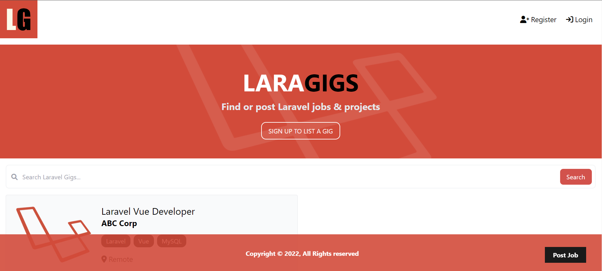

# Laragigs

Laragigs is a A job posting app built with Laravel and Bootstrap. Implemented authentication and CRUD functionality for job postings and user profiles.

- Create Read Update Delete functionality.
- User authorization.
- MySQL Database.
- Styled with Bootstrap css framework

### Live Demo
<a href="https://www.laragigs.ashoemakerdev.com" target="_blank">Laragigs</a>
